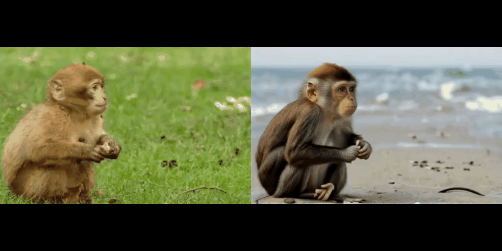
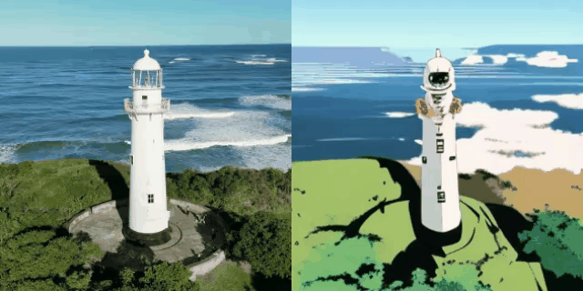
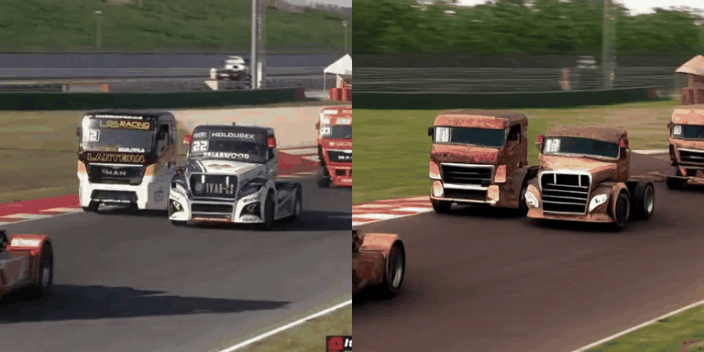

### RAVE: Randomized Noise Shuffling for Fast and Consistent Video Editing with Diffusion Models - Official Repo
### CVPR 2024 (Highlight)

[Ozgur Kara](https://karaozgur.com/), [Bariscan Kurtkaya](https://bariscankurtkaya.github.io/), [Hidir Yesiltepe](https://sites.google.com/view/hidir-yesiltepe), [James M. Rehg](https://scholar.google.com/citations?hl=en&user=8kA3eDwAAAAJ), [Pinar Yanardag](https://scholar.google.com/citations?user=qzczdd8AAAAJ&hl=en)

<a href="https://huggingface.co/spaces/ozgurkara/RAVE">
<a href='https://arxiv.org/abs/2312.04524'></a> 
<a href='https://rave-video.github.io/'></a>
<a href='https://youtu.be/2hQho5AC9T0?si=3R_jYDbcL2olODCV'></a>
<a href='https://rave-video.github.io/supp/supp.html'></a>
[](https://github.com/rehg-lab/RAVE)


(Note that the videos on GitHub are heavily compressed. The full videos are available on the project webpage.)

## Abstract
<b>TL; DR:</b> RAVE is a zero-shot, lightweight, and fast framework for text-guided video editing, supporting videos of any length utilizing text-to-image pretrained diffusion models. 

<details><summary>Click for the full abstract</summary>


> Recent advancements in diffusion-based models have demonstrated significant success in generating images from text. However, video editing models have not yet reached the same level of visual quality and user control. To address this, we introduce RAVE, a zero-shot video editing method that leverages pre-trained text-to-image diffusion models without additional training. RAVE takes an input video and a text prompt to produce high-quality videos while preserving the original motion and semantic structure. It employs a novel noise shuffling strategy, leveraging spatio-temporal interactions between frames, to produce temporally consistent videos faster than existing methods. It is also efficient in terms of memory requirements, allowing it to handle longer videos.  RAVE is capable of a wide range of edits, from local attribute modifications to shape transformations. In order to demonstrate the versatility of RAVE, we create a comprehensive video evaluation dataset ranging from object-focused scenes to complex human activities like dancing and typing, and dynamic scenes featuring swimming fish and boats. Our qualitative and quantitative experiments highlight the effectiveness of RAVE in diverse video editing scenarios compared to existing methods.
</details>

<br>

**Features**:
- *Zero-shot framework*
- *Working fast*
- *No restriction on video length*
- *Standardized dataset for evaluating text-guided video-editing methods*
- *Compatible with off-the-shelf pre-trained approaches (e.g. [CivitAI](https://civitai.com/))*


## Updates
- [12/2023] Gradio demo is released, HuggingFace Space demo will be released soon
- [12/2023] Paper is available on ArXiv, project webpage is ready and code is released.

### TODO
- [ ] Share the dataset
- [X] Add more examples
- [X] Optimize preprocessing
- [X] Add CivitAI models to Grad.io
- [X] ~~Prepare a grad.io based GUI~~
- [X] ~~Integrate MultiControlNet~~
- [X] ~~Adapt CIVIT AI models~~

## Installation and Inference

### Setup Environment
Please install our environment using 'requirements.txt' file as:
```shell
conda create -n rave python=3.8
conda activate rave
conda install pip
pip cache purge
pip install -r requirements.txt
```
Also, please install PyTorch and Xformers as
```shell
pip install torch==2.0.1 torchvision==0.15.2 torchaudio==2.0.2 --index-url https://download.pytorch.org/whl/cu118
pip install xformers==0.0.20
```
to set up the Conda environment.

Our code was tested on Linux with the following versions:
```shell
timm==0.6.7 torch==2.0.1+cu118 xformers==0.0.20 diffusers==0.18.2 torch.version.cuda==11.8 python==3.8.0
```

### WebUI Demo

To run our grad.io based web demo, run the following command:
```shell
python webui.py
```
Then, specify your configurations and perform editing.


### Inference


To run RAVE, please follow these steps:

1- Put the video you want to edit under `data/mp4_videos` as an MP4 file. Note that we suggest using videos with a size of 512x512 or 512x320.

2- Prepare a config file under the `configs` directory. Change the name of the `video_name` parameter to the name of the MP4 file. You can find detailed descriptions of the parameters and example configurations there.

3- Run the following command:
```shell
python scripts/run_experiment.py [PATH OF CONFIG FILE]
```
4- The results will be generated under the `results` directory. Also, the latents and controls are saved under the `generated` directory to speed up the editing with different prompts on the same video.
Note that the names of the preprocessors available can be found in `utils/constants.py`.

### Use Customized Models from CIVIT AI

Our code allows to run any customized model from CIVIT AI. To use these models, please follow the steps:

1- Determine which model you want to use from CIVIT AI, and obtain its index. (e.g. the index for RealisticVision V5.1 is 130072, you can find the id of the model in the website link as a parameter assigned to 'VersionId', e.g. https://civitai.com/models/4201?modelVersionId=130072)

2- In the current directory, run the following code. It downloads the model in safetensors format, and converts it to '.bin' format that is compatible with diffusers.
```shell
bash CIVIT_AI/civit_ai.sh 130072
```
3- Copy the path of the converted model, `$CWD/CIVIT_AI/diffusers_models/[CUSTOMIZED MODEL]` (e.g. `CIVIT_AI/diffusers_models/realisticVisionV60B1_v51VAE` for 130072), and use the path in the config file.


## Dataset

Dataset will be released soon.

## Examples 
### Type of Edits
<table>
<tr>
  <td></td>
  <td></td>
  <td></td>
</tr>
<tr>
  <td width=33% style="text-align:center;">1- Local Editing</td>
  <td width=33% style="text-align:center;">2- Visual Style Editing</td>
  <td width=33% style="text-align:center;">3- Background Editing</td>
</tr>
</table>

<table>
<tr>
  <td></td>
  <td></td>
</tr>

<tr>
  <td width=50% style="text-align:center;">4- Shape/Attribute Editing</td>
  <td width=50% style="text-align:center;">5- Extreme Shape Editing</td>
</tr>
</table>

### Editing on Various Types of Motions
<table>
<tr>
  <td></td>
  <td></td>
  <td></td>
</tr>
<tr>
  <td width=33% style="text-align:center;">1- Exo-motion</td>
  <td width=33% style="text-align:center;">2- Ego-motion</td>
  <td width=33% style="text-align:center;">3- Ego-exo motion</td>
</tr>
</table>

<table>
<tr>
  <td></td>
  <td></td>
</tr>

<tr>
  <td width=50% style="text-align:center;">4- Occlusions</td>
  <td width=50% style="text-align:center;">5- Multiple objects with appearance/disappearance</td>
</tr>
</table>

## Citation 

```
@inproceedings{kara2024rave,
  title={RAVE: Randomized Noise Shuffling for Fast and Consistent Video Editing with Diffusion Models},
  author={Ozgur Kara and Bariscan Kurtkaya and Hidir Yesiltepe and James M. Rehg and Pinar Yanardag},
  booktitle={Proceedings of the IEEE/CVF Conference on Computer Vision and Pattern Recognition},
  year={2024}
}

``` 

## Maintenance

This is the official repository for **RAVE: Randomized Noise Shuffling for Fast and Consistent Video Editing with Diffusion Models**. Feel free to contact for any questions or discussions [Ozgur Kara](ozgurrkara99@gmail.com).
